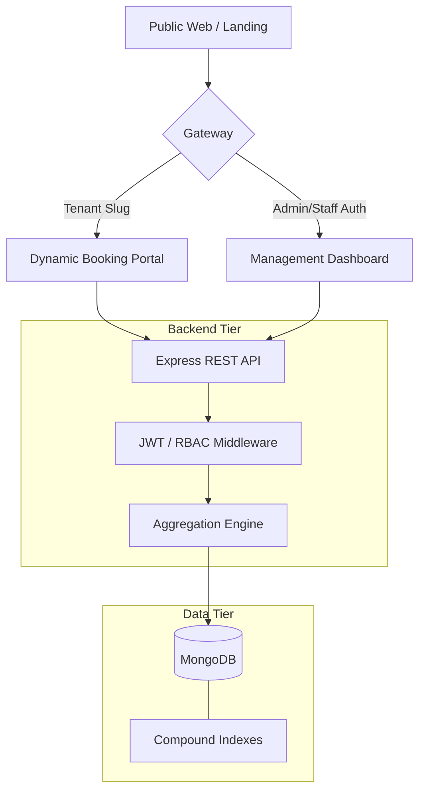

# BookFlow – Premium Multi-Tenant SaaS Booking Platform

[](https://opensource.org/licenses/MIT)
[]()
[]()

> A world-class, production-ready appointment booking engine. Built for scalability, high performance, and a stunning "wow" user experience.

---

## ⚡ Technical Core

BookFlow is not just a booking app; it's a **multi-tenant infrastructure** designed to handle hundreds of businesses independently while maintaining extreme performance and security.

### 🛠️ Tech Stack
- **Frontend:** React 18, Redux Toolkit, **Glassmorphism UI Engine**, Lucide Icons, Date-fns.
- **Backend:** Node.js, Express, **Compression Middleware**, Morgan Logging.
- **Database:** MongoDB with **Mongoose Compound Indexing** (multi-tenant isolation).
- **Security:** Dual-token JWT (Access/Refresh), CSRF Protection, Hierarchical RBAC.
- **Payments:** Stripe PaymentIntents API + Webhook Synchronization.
- **DevOps:** Docker, Kubernetes (Amazon EKS), AWS ECR, GitHub Actions CI/CD.
- **Infrastructure:** Provisioned via Terraform.

---

## 🌍 Infrastructure & Deployment

BookFlow is engineered for high availability and enterprise scale using modern cloud-native deployment patterns:

- **Containerization**: Fully Dockerized frontend, backend, and database environments for strict development and production parity.
- **Kubernetes Orchestration**: Deployed natively on **Amazon EKS (Elastic Kubernetes Service)** to ensure self-healing, zero-downtime rolling updates, and scalable pod management.
- **AWS Cloud Native**: Leverages AWS VPC boundaries, Elastic Load Balancing (ELB) for traffic distribution, and Amazon ECR for secure container image storage.
- **GitOps CI/CD**: Fully automated GitHub Actions pipelines that build new Docker images on push, tag them via Git Commit SHA, push to ECR, and trigger automated deployments to the K8s cluster.
- **Infrastructure as Code**: The entire AWS ecosystem and EKS cluster are provisioned automatically using **Terraform**.

---

## 🏗️ Architecture Design

BookFlow utilizes a **Single Database, Shared Schema** approach with strictly enforced logical isolation via `tenantId`.



### 🔐 Advanced RBAC & Hierarchy
We implemented a professional **"Reports To"** hierarchy allowing for complex organizational management:
- **Super Admin**: Platform-wide visibility and tenant management.
- **Tenant Admin**: Full control over their business, services, and staff.
- **Manager**: Controls their own bookings and the bookings of staff who **report to them**.
- **Staff**: Secure, restricted view of only their assigned appointments.
- **Customer**: Clean, high-performance checkout experience.

---

## ✨ Enterprise-Grade Features

| Feature | Detail |
|---|---|
| **💎 Premium UI** | Dynamic glassmorphism booking portal with real-time checkout summary. |
| **🎟️ Coupon Engine** | Percentage/Fixed discounts with min-spend and validity logic. |
| **⏳ Waitlist System** | Intelligent queue management with hierarchical staff allocation. |
| **⭐️ Verified Reviews** | Integrated rating system linked to completed appointments. |
| **📅 Availability Logic** | Multi-layer slot calculation: Staff Schedules - Absences - Breaks - Existing Bookings. |
| **📊 Analytics Suite** | Real-time revenue trends, peak occupancy, and staff performance metrics. |
| **📧 Notification Pipeline** | Automated HTML emails for booking confirmations, changes, and cancellations. |

---

## 🚀 Getting Started

### 1. Environment Configuration
Create a `.env` file in the `backend` directory:
```bash
PORT=5000
MONGO_URI=mongodb://localhost:27017/bookflow
JWT_SECRET=your_super_secret_key
REFRESH_TOKEN_SECRET=your_refresh_secret
STRIPE_SECRET_KEY=sk_test_...
EMAIL_USER=your_smtp_user
EMAIL_PASS=your_smtp_pass
CLIENT_URL=http://localhost:5173
```

### 2. Rapid Development Setup
```bash
# Install & Start Backend
cd backend
npm install
npm run dev

# In another terminal: Install & Start Frontend
cd frontend
npm install
npm run dev
```

### 3. Database Seeding (Optional)
```bash
# Seed initial roles and a test coupon
cd backend
node src/utils/seedRoles.js
node seed-coupon.js
```


---

## 📸 Dashboard & Portal
*Beautiful, responsive interfaces for both administrators and customers.*

> [!TIP]
> **Pro Discovery:** Try visiting `/onboard` to see the seamless business registration flow, then head to `/book/tailor` to experience the world-class customer journey.

---
© 2026 BookFlow. All rights reserved.
